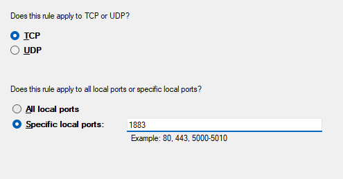

# Quick start for MQTT (Mosquitto) & Pico W on Windows

(WIP: Will add more detail soon, as well as how to work the secure options).

This is mainly for me, however hopefully some else may find it useful.

Using Windows because ceebs swapping between dual boot or using a VM.

To build the project, install the [Raspberry Pi Pico Extension](https://marketplace.visualstudio.com/items?itemName=raspberry-pi.raspberry-pi-pico)

Currently, the project code isn't any different from the example [mqtt pico-example](https://github.com/raspberrypi/pico-examples/tree/master/pico_w/wifi/mqtt), if you encounter any errors, the project can be generated via the extension.

## Mosquitto MQTT Broker

1. Download Mosquitto: https://mosquitto.org/download/
2. Follow this tutorial from Cedalo: https://cedalo.com/blog/how-to-install-mosquitto-mqtt-broker-on-windows/.

Once you have mosquitto enabled and running as a Windows Service, and after editing the `mosquitto.conf` file,
try building the project, and programming the pico. Use PuTTY or the provided `log.py` script to view the logging over serial USB.

To view any messages published to any topic, run the following command in a new terminal (assuming port 1883):

Powershell:

`./mosquitto_sub -h 127.0.0.1 -p 1883 -t "#" -v`

CMD:

`mosquitto_sub -h 127.0.0.1 -p 1883 -t "#" -v`

There a several ways the pico may panic, I encountered these:

1.  "Failed to connect" - to the WiFi network. Check your WiFi credentials are set correctly in the `CMakeLists.txt` file.
2.  "dns request failed" - couldn't resolve the broker's hostname. It is easiest to set your machine's local IP as the hostname in the `CMakeLists.txt` file.
3.  "Failed to connect to mqtt server" - With the mosquitto configured to allow annonymous listeners on 1883, you still may encounter this. How I got around it, **for testing only**, was to add an Inbound Rule to Window's Defender Firewall.

## Windows Firewall - Insecure! For testing only! (WIP)

It should be noted that it is not recommended to leave this rule enabled. It is **insecure**, so it should be disabled (or deleted) when not in use!

This step may not be required if usernames and passwords are set up for the mosquitto broker.

### 1. Create a new Inbound Rule

### 2. Select "Port"

### 3. TCP and Specific Port 1883

Another port may be specified, but make sure it is consistent with the mosquitto.conf file.

### 4. Allow the connection

Allow _all_ connections.

### 5. This rule applies on all networks

Didn't work for me without selecting all networks

### 6. Give the rule a name

Again, make sure the port is consistent with whatever you specified previously in step 3 (and whichever port specified in the mosquitto.conf).

